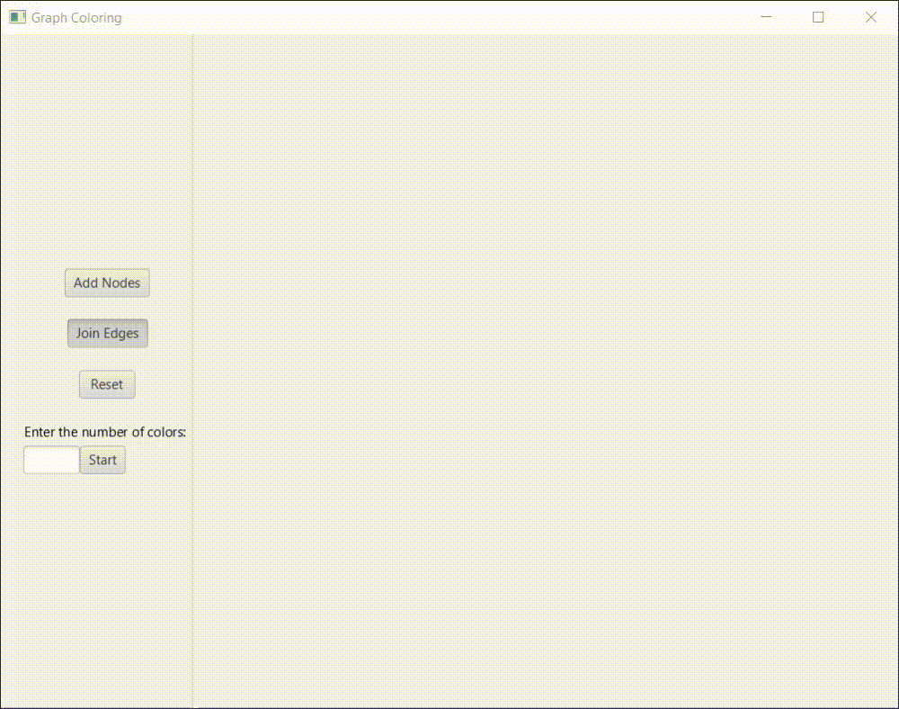

# Graph Coloring GUI

This is a visual representation of the m-Coloring problem.

### Algorithm Used
Backtracking

## Features:
- Add vertices and edges to the screen.
- Provide the number of colors
- Clear the screen
- Warns if the graph can not be colored with the provided number of colors
- Warns if the number of colors is not provided

## Folder Structure

The workspace contains two folders, where:

- `.vscode`: stores the settings.json and launch.json files
- `src`: the folder to maintain sources
- `bin`: to store the class files

## Requirements
In order to run this application you must have the latest version of Java installed(JDK11 at least) and JavaFX jar files imported.

## Demo

Made by Garvit Verma (2022).

