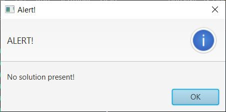

# n-Queens GUI

This is a visual representation of the n-Queens problem.

### Algorithm Used
Backtracking

## Features:
- Size of chessboard can be specified
- Alerts if the solution is not possible

## Folder Structure

The workspace contains two folders, where:

- `src`: the folder to maintain sources
- `bin`: to store the class files

## Requirements
In order to run this application you must have the latest version of Java installed(JDK11 at least) and JavaFX jar files imported.

## Demo
- #### Starting Screen

- #### Chess Board produced after clicking on `Enter` button

- #### Solution generated after clicking on `Click to Start` button

- #### Alert produced in case solution is not present

Made by Garvit Verma (2022).

